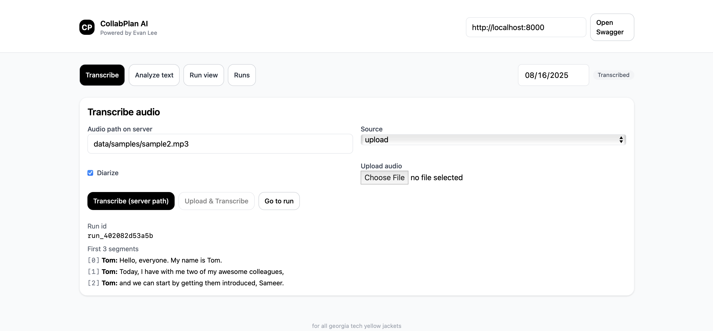
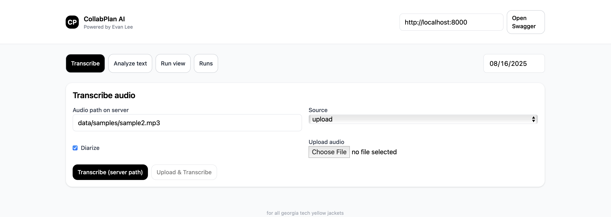
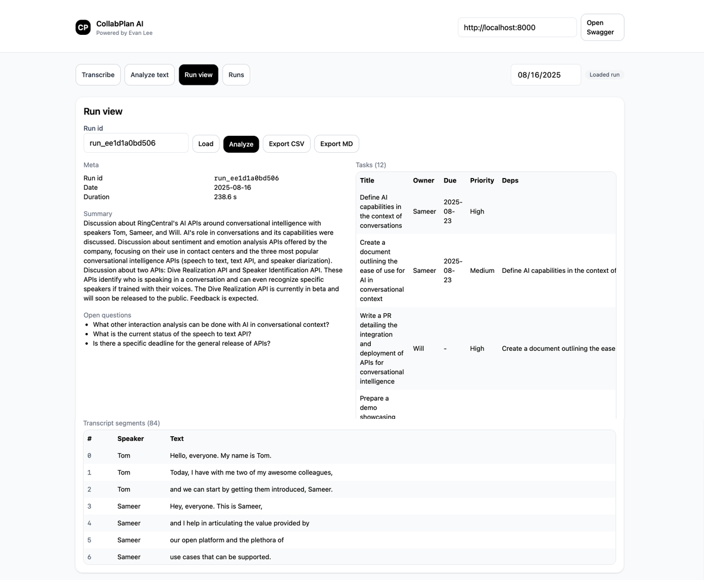
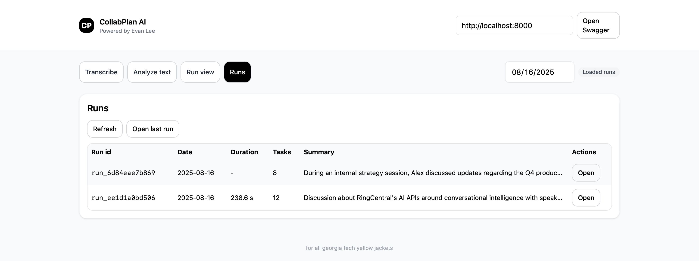

# CollabPlan-AI
Lightweight, local-first **meeting & conversation intelligence**: transcribe audio, extract actionable tasks, and export outcomes — all from a simple web UI.


> **Use it for more than meetings.** CollabPlan-AI works with any conversation: support calls, daily stand-ups, ad-hoc voice notes — even a 15-second personal reminder.

## Overview

CollabPlan-AI consists of a FastAPI backend and a React (Vite + Tailwind) frontend.


**High-level workflow**

1. **Ingest audio or text**
   - *Transcribe*: point at a server-side audio file, upload a file from your device, or record in the browser.
   - *Analyze text*: paste raw text to skip audio altogether.

2. **ASR & Diarization**
   - **faster-whisper** (CTranslate2) performs speech-to-text (optionally with VAD).
   - **pyannote.audio** performs speaker diarization; segments are aligned to speakers.

3. **LLM-based planning**
   - The transcript is summarized and converted into structured tasks (owners, due dates, priorities) and open questions via an LLM (runs locally via **Ollama**).

4. **Review & export**
   - View transcript segments, summary, tasks, and open questions in the UI.
   - Export results to **CSV** or **Markdown**.


## Features

- 🎙️ **Transcription** with optional diarization (per-speaker attribution)
- 🤖 **LLM planning**: summaries, tasks, and open questions
- 📤 **Exports**: `run_<id>.csv` and `run_<id>.md`
- 🧭 **Run history**: browse, reload, and re-analyze prior runs
- 🌐 **OpenAPI / Swagger UI**: explore endpoints interactively

## Tech Stack

- **Backend**
  - **FastAPI** (HTTP API, OpenAPI docs)
  - **SQLModel + SQLAlchemy** (persistence)
  - **faster-whisper** (ASR, via CTranslate2)
  - **pyannote.audio [HuggingFace]** (diarization)
  - **Ollama** (LLM runtime for summarization & task extraction)
  - **Uvicorn** (ASGI server)

- **Frontend**
  - **React + Vite**
  - **Tailwind CSS**

- **System tools**
  - **FFmpeg** (audio normalization to 16kHz mono WAV for stable ASR/diarization)

## UI
### Transcribe


### Analyze Text


### Run View


### Runs List


## Quick Start

### 0) Prerequisites

- **Python 3.12+**
- **Node.js 18+** (for the web UI)
- **FFmpeg**  
  macOS: `brew install ffmpeg`

- **Hugging Face token** (for pyannote diarization)  
  Create a free token and export it:
  ```bash
  export HUGGINGFACE_TOKEN=hf_xxx...
    ```
- **Ollama (LLM runtime)**
 install from https://ollama.com/download and start the daemon:
    ```bash
    # Example: pull a small, fast model for local inference
    ollama pull llama3.1:8b
    ```
### 1) Set up Virtual Env and install requirements
```bash
python -m venv collab-ai
source collab-ai/bin/activate   # Windows: collab-ai\Scripts\activate

pip install --upgrade pip
pip install -r requirements.txt
```

### 2) Run the API
```bash
uvicorn api.main:app --reload --port 8000
```

### 3) Run the Web UI
```bash
cd ../collabplan-ui
npm install
npm run dev
```
## Using the App
### A) Transcribe (Server file, Upload, or Recording)

- **Source = upload (server path)**  
  Provide a path available to the server (e.g., `data/samples/sample2.mp3`) and click **Transcribe**.

- **Source = upload (device)**  
  Choose a local audio file and click **Upload & Transcribe**.  
  The server normalizes audio to 16kHz mono WAV for stable diarization.

- **Source = recording**  
  Use the built-in browser recorder to capture a short snippet and then transcribe.

- **Diarize toggle**  
  When enabled, `pyannote` maps segments to speakers (`S0`, `S1`, …).  
  The app attempts basic name mapping from intros like “My name is …”.

### B) Run View

- After a transcription:
    - **Meta**: run id, meeting date, duration  
    - **Summary** and **Open questions**  
    - **Tasks**: title, owner, due date, priority, dependencies, confidence  
    - **Transcript segments**: index, (speaker), text  
- Click **Analyze** to (re)run the LLM planning on the current run.

### C) Analyze Text
- Paste raw text and click **Analyze text** — the backend will create a run from text only.

### D) Runs
- Browse previously created runs, open a run, and export to **CSV/MD**.

## OpenAPI / Swagger

Browse and test endpoints live at [http://localhost:8000/docs](http://localhost:8000/docs).

**Key routes:**
- `POST /transcribe` — transcribe a server-side audio path  
- `POST /transcribe_upload` — upload an audio file then transcribe  
- `POST /analyze` — analyze a pasted transcript (text → plan)  
- `POST /analyze/{run_id}` — analyze an existing run  
- `GET /run/{run_id}` — fetch run bundle (segments + plan)  
- `GET /runs` — list runs  
- `GET /export/{run_id}.csv` / `.md` — export plan 

## Configuration
- **CORS**: backend allows `http://localhost:5173` by default (see `api/main.py`).  
- **Audio normalization**: server converts all inputs to **16kHz mono WAV** via **FFmpeg** before ASR/diarization.  
- **LLM model**: controlled by your **Ollama** setup (e.g., `llama3.1:8b`); selection is implemented in `core/extract`.  

## Demo Video 
<iframe width="560" height="315" src="https://youtu.be/iZvC5hSalXE" 
frameborder="0" allowfullscreen></iframe>
